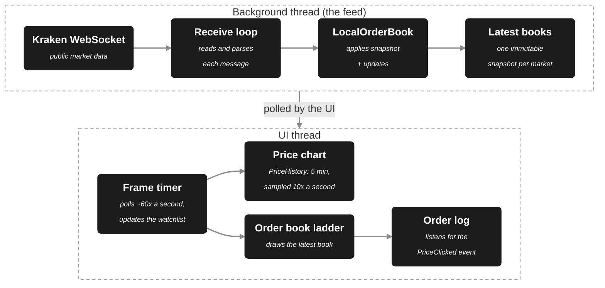

# Live Trading Screen

A read-only Windows desktop demo (C#, WPF/XAML, .NET 10) of a real-time trading screen: a scrolling price chart, an order-book ladder and a watchlist, fed by **live order-book data** or an offline simulator. It is designed so that **someone who has never traded can read it** — every panel explains itself in plain English.


> **Read-only demonstration.** The app never places real orders and no money is involved. Clicking a price only adds a line to an on-screen log. Nothing here is financial advice.

## At a glance

- **Real-time data:** live order books for five crypto markets from Kraken's public WebSocket API, plus an offline simulated feed.
- **Stays responsive under load:** a background thread publishes immutable snapshots and the UI pulls them at frame rate, so the UI does the same work whether 60 or 17,000 updates arrive per second.
- **Custom-rendered controls:** the chart (line and candlestick, crosshair, live time axis) and the order-book ladder are drawn directly with `OnRender`, at roughly 0.5–0.8 ms of UI-thread time per frame.
- **Tested where it matters:** 82 xUnit tests on the order-book, price-history and click logic. They caught a real price-rounding bug.
- **Built for beginners:** plain-English section descriptions, tooltips and a glossary.
- **AI-assisted, human-directed:** built with Claude Code as a pair-programmer. See [My role and how I used AI](#my-role-and-how-i-used-ai).

## Why I built it

The hard part of a trading UI is **data arriving far faster than a screen can show it.** A naive WPF app that updates the UI on every message either crashes (touching UI objects from the wrong thread) or freezes (thousands of queued UI calls per second). I wanted a project that solves that properly, presents it clearly enough for a non-trader to follow, and keeps the code easy to explain.

## Demos

**Chart features:** hover crosshair, line ↔ candles, 1 / 2 / 5 minute windows. _Recorded on the **simulated** feed, because real markets were too quiet to show the chart moving._


**Real market data:** switching between live Kraken markets, each with its own history and order book. _Recorded on the **live Kraken feed**. Real prices barely moved during the recording, so the charts are mostly flat stretches and small steps. On XRP/USD the ladder groups several price steps per row ("1 row = 0.00002") so both sides of the market stay on screen._


**Click to trade (simulated):** clicking the buyer (blue) and seller (red) sides of the ladder logs an order at the clicked price. Nothing is sent anywhere. _Recorded on the **live Kraken feed**._


## How it works



### The central decision: the UI pulls, the feed never pushes

The feed thread **never touches the UI**. It keeps a private working copy of each order book, and after every change it publishes a finished, **immutable** snapshot into a shared dictionary, replacing the old one atomically. The UI thread **polls** that dictionary on a fixed ~60 Hz timer and draws whatever is latest.

What that buys:

- **No cross-thread UI access for market data:** no per-update dispatcher calls and no locks around the books. The one deliberate exception is the rare connection-status message, which hops to the UI thread.
- **UI cost is set by the timer, not the feed.** Double the feed rate and the UI does the same amount of work. The usual alternative, one `Dispatcher.BeginInvoke` per update, queues work faster than the UI thread can drain it at high rates.
- **The UI can never see a half-updated book**, because it only ever sees finished snapshots.
- **Invisible updates are dropped on purpose.** The 500th change to a price within one frame is never drawn, because nobody could see it.

Measured on my machine (your numbers will differ): on the simulated feed, 13,000–17,000 book updates per second arrived while the screen refreshed 38–40 times per second, and the chart's drawing code cost 0.5–0.8 ms per frame. The live Kraken feed is far calmer, at roughly 60–270 updates per second in my runs. The app shows these figures in a small "For developers" line.

### Other design decisions

- **Feed behind an interface.** The UI only knows `IMarketDataSource` (`StartAsync`, `GetInstruments`, `GetLatestBook`, and a rare `StatusChanged` event), so the live and simulated feeds are interchangeable. High-rate data is polled; only rare news is an event.
- **Prices are integers inside the book.** Levels are keyed by whole ticks, so `0.1 + 0.2` and `0.3` land on the same level instead of creating a near-duplicate.
- **History is sampled, not recorded per update.** Memory and drawing cost stay bounded however fast data arrives: 5 minutes × 10 samples a second is about 3,000 points per market.
- **Hand-drawn chart and ladder instead of grid controls.** One element records drawing commands in `OnRender`, instead of thousands of per-cell elements going through layout and binding. The five-row watchlist does use a `DataGrid`, where that cost doesn't matter.
- **Logic separated from UI so it can be tested.** `PriceHistory`, `LocalOrderBook` and `LadderMath` have no UI dependencies.

## Tests

```powershell
dotnet test tests/TradingApp.Tests
```

82 unit tests (xUnit) cover the logic that is easiest to get subtly wrong:

- **`LocalOrderBook`:** snapshot vs. update, size-0 removal, bid/ask ordering, depth trimming, floating-point-dust prices, and the property the threading design depends on: an earlier snapshot is never changed by later updates.
- **`PriceHistory`:** retention and the memory bound, out-of-order and invalid samples, binary search, candle aggregation and clock alignment.
- **`LadderMath`:** which row, price and side a click means, including exact boundaries, and the grouping rules for sparse markets.

The tests caught a real bug during development: clicking DOGE/USD logged `0.092835` instead of `0.0928347`, because prices were rounded to a fixed 6 decimals and that market needs 7. Prices now round to each market's own tick size, and a regression test pins it.

Not covered by unit tests: the WebSocket/JSON handling and the drawing code. I verified those by running the app against the live feed and checking screenshots.

## Running it

**Requirements:** Windows and the [.NET 10 SDK](https://dotnet.microsoft.com/download) (WPF is Windows-only).

```powershell
dotnet run
```

It connects to Kraken and fills the watchlist. The chart starts empty and fills in as the app runs, since history is kept in memory only.

**Offline, or want a livelier chart?** Use the simulated feed. The banner changes to say the prices are simulated.

```powershell
$env:TRADINGAPP_FEED = "fake"
dotnet run
```

Kraken's public market data is free and needs no account, but whether it is reachable can depend on your region.

## Project layout

| File | What it is |
| --- | --- |
| [`IMarketDataSource.cs`](IMarketDataSource.cs) | The contract between UI and feed, with the reasoning behind each member |
| [`KrakenMarketDataSource.cs`](KrakenMarketDataSource.cs) | Live feed: WebSocket, JSON parsing, reconnects |
| [`FakeMarketDataSource.cs`](FakeMarketDataSource.cs) | Simulated feed for offline use and demos |
| [`LocalOrderBook.cs`](LocalOrderBook.cs) | Applies snapshots and updates; produces immutable snapshots |
| [`OrderBookSnapshot.cs`](OrderBookSnapshot.cs), [`Instrument.cs`](Instrument.cs) | Immutable data types (records) |
| [`PriceHistory.cs`](PriceHistory.cs) | Rolling price window and candle aggregation |
| [`PriceChartControl.cs`](PriceChartControl.cs) | The hand-drawn chart |
| [`LadderControl.cs`](LadderControl.cs), [`LadderMath.cs`](LadderMath.cs) | The hand-drawn order book, and its click and grouping arithmetic |
| [`LadderClickEventArgs.cs`](LadderClickEventArgs.cs) | What a ladder click carries: symbol, price, side |
| [`MainWindow.xaml`](MainWindow.xaml), [`MainWindow.xaml.cs`](MainWindow.xaml.cs) | Layout, theme, and the wiring between feed and controls |
| [`tests/TradingApp.Tests`](tests/TradingApp.Tests) | Unit tests |
| [`.claude/skills`](.claude/skills) | Claude Code skills that encode this project's rules (see below) |

## My role and how I used AI

I built this with [Claude Code](https://claude.com/claude-code) as a pair-programmer. It wrote most of the first-draft C# and XAML. The product direction, the core architecture and the quality bar were mine, and I reviewed the implementation-level choices it proposed. This was my first WPF application and my first C# in over five years; my day-to-day background is JavaScript/TypeScript.

**What I brought**

- **Product and UX direction.** I chose the audience (people who have never traded) and the rule that every panel explains itself. I chose free public crypto order books as the real data source. I pushed for a strong visual centrepiece, because in my previous job a compelling visual was what got people to look closer at a project.
- **The core architecture.** Working through the threading problem, I arrived at the design the app is built on: the background thread keeps only the latest state, and the UI pulls it at a fixed frame rate instead of being pushed every update. I also proposed recording chart history in memory from the live stream, with the retention window sized by performance, rather than adding a second data feed.
- **Quality and verification.** I made unit tests a requirement for the logic that is easy to get subtly wrong. I reviewed and ran the code, did manual QA against live data, and read through the critical functions myself rather than trusting generated code by default.
- **Guardrails for AI-assisted work.** I added two Claude Code skills that encode this project's threading rules and verification steps, so future AI-assisted changes are checked against the design.
- **Learning an unfamiliar stack quickly.** I relearned C# and learned WPF/XAML by mapping each concept to its JavaScript/TypeScript equivalent (properties vs. getters, events vs. `addEventListener`, `async`/`await` resuming on the UI thread).

**Where Claude Code helped**

- Scaffolding and first drafts of the C#, XAML, tests and documentation, which I reviewed, ran and adjusted.
- Faster lookup of domain basics: order books, bid/ask, spread, candles.
- A fast build-test-run loop, including launching the app against live data and checking screenshots. That loop caught a price-rounding bug on fine-tick markets (through the unit tests), a blank order book on wide-spread markets, and a chart scale that flattened quiet markets.
- Scripted demo capture: the GIFs above were produced with window capture and UI automation.

### Project skills

The repository includes two [Claude Code skills](https://code.claude.com/docs/en/skills) in [`.claude/skills`](.claude/skills). Start Claude Code in this folder and type `/skills` to list them.

| Skill | Run it with | What it does |
| --- | --- | --- |
| `threading-review` | `/threading-review` (Claude Code can also apply it on its own when a change touches threading) | Reviews a change against this app's threading rules: the feed thread never touches the UI, data crosses threads only as immutable snapshots, the UI polls at frame rate. Reports each violation with a concrete failure scenario and the smallest fix; it does not edit code. |
| `verify-app` | `/verify-app` or `/verify-app live` | Compiles the app, runs the unit tests, and smoke-tests that the window starts, reporting each separately. It never stops a process it did not start, so it won't close a copy of the app you have open. |

## Limitations and next steps

- **No trading.** Clicks only append to a log, quantity is fixed at 1, and there are no positions, fills or profit/loss. Next: simulated fills against the live book, with position and P&L.
- **No checksum verification.** Kraken sends a checksum with each book update to detect a corrupted local book; the app doesn't verify it yet. Next: verify it, and resubscribe for a fresh snapshot on mismatch.
- **No trade data.** Without the executed-trades channel there is no last-trade marker or volume. Next: subscribe to trades.
- **Wiring lives in code-behind.** `MainWindow.xaml.cs` connects the feed to the controls directly. That is fine at this size; a larger app would move it into view models (MVVM).
- **History is in memory only**, and the app is **Windows-only** (WPF).

## Data and acknowledgements

**Market data** comes from [Kraken's public WebSocket API (v2)](https://docs.kraken.com/api/docs/websocket-v2/book). This project is not affiliated with or endorsed by Kraken.

**Simulated data** (`TRADINGAPP_FEED=fake`) is made up and has no connection to any real market:

- The five names (`AAPL`, `MSFT`, `GOOG`, `AMZN`, `TSLA`) are ticker symbols of well-known public companies, used only as familiar labels. The prices are **not** real quotes.
- Each market starts at a random price between $100 and $200, with a one-cent price step.
- Many times per second, a random market's price moves up one cent, down one cent, or stays put (a random walk). If it drifts more than $3 from its start, it is nudged back so the chart stays on screen.
- Every update produces a complete order book in the same format as the live feed (the same `OrderBookSnapshot` type behind the same `IMarketDataSource` interface): a one-cent spread, ten price levels per side, and random sizes between 1 and 499.
- It is deliberately busier than a real market (on the order of ten thousand updates per second) to exercise the app under load and give the demos visible motion.
- It leaves out a lot: markets move independently, there are no trades, and volatility doesn't cluster the way it does in real markets. It tests how the app behaves. It is not a model of how prices behave.

## License

[MIT](LICENSE). Free to use, copy, modify and distribute, provided the copyright and license notice are kept.
