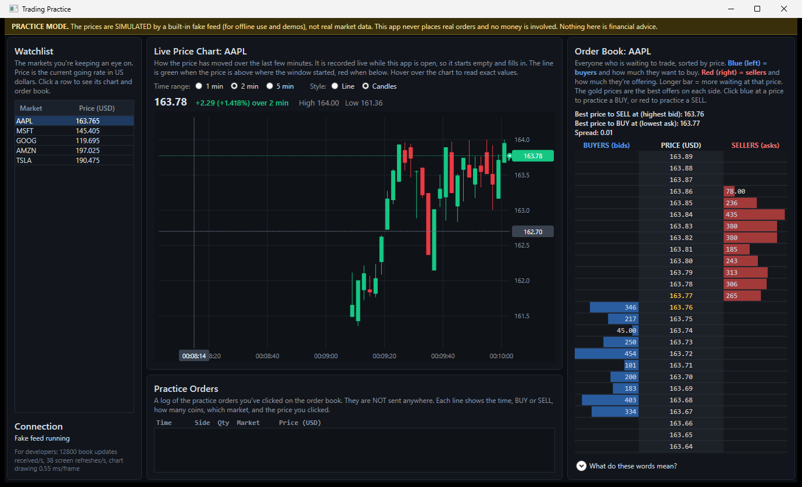
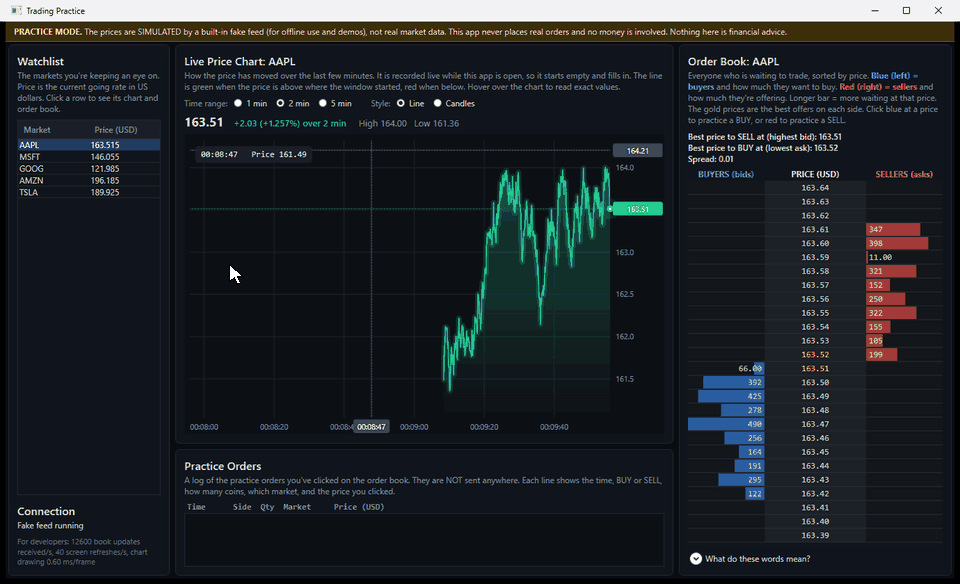
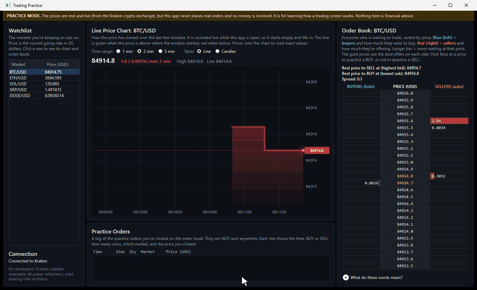
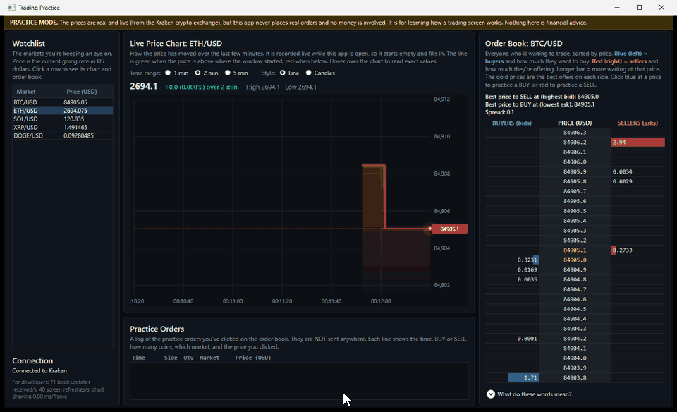
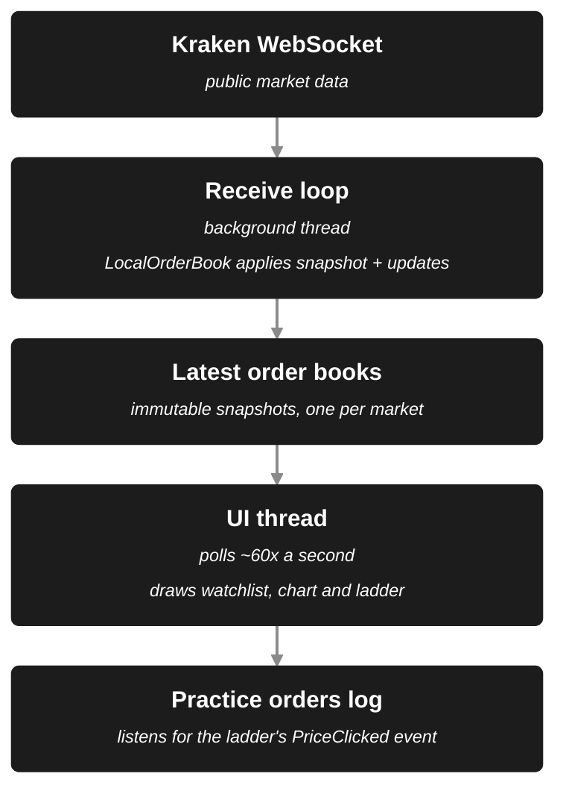

# Trading Application Practice

A Windows desktop app (WPF, C#, .NET 10) that shows a live or simulated trading screen — a scrolling price chart, an order-book ladder and a watchlist — built to be **readable by complete beginner traders**. Every panel explains itself in plain English, and it is read-only: nothing it does ever places a real order.



> **Practice mode (read-only).** The app never places real orders and no money is involved. It is a learning and engineering project, not financial advice.

## Why I built it

I wanted a project that exercises the hard part of a trading UI: **a stream of data arriving far faster than a screen can show it.** A naive WPF app that updates the UI on every message either crashes (touching UI objects from the wrong thread) or freezes (thousands of queued UI calls per second). This project is built around avoiding both, and it keeps the code readable enough to explain.

## What it does

- **Live price chart** drawn by hand with `OnRender`: line mode (glow + gradient fill) and candlestick mode, 1 / 2 / 5 minute windows, a time axis tied to the clock so labels glide, a price scale that eases rather than jumps, a pulsing last-price marker, and a crosshair with an OHLC readout. History is recorded live while the app runs.
- **Order-book ladder**, also hand-drawn: buyers on the left, sellers on the right, bar length = size, best bid/ask highlighted. When a market is sparse it automatically **groups several price steps per row** so the interesting part stays on screen.
- **Click to trade (practice):** click the blue side of a price to practice a buy, the red side to practice a sell. The click becomes an event; a practice-orders log listens.
- **Real market data** from Kraken's public WebSocket API (BTC, ETH, SOL, XRP, DOGE against USD) — free, no account or API key. A built-in simulated feed works offline.
- **Beginner-first UI:** a header and description on every section, tooltips, a collapsible glossary (bid, ask, spread, tick, candle…), and a banner stating plainly that nothing is real money.

## Demos

**Chart features** — hover crosshair, line ↔ candles, 1 / 2 / 5 minute windows. _Recorded on the **simulated** feed, because real markets were too quiet to show the chart moving._



**Real market data** — switching between live Kraken markets, each with its own history and order book. Note the status line and the banner. _Recorded on the **live Kraken feed**; the real prices barely moved during the recording, so the charts are mostly steps and flat stretches. The ladder on XRP/USD shows the automatic grouping ("1 row = 0.00002")._



**Click to trade** — clicking the buyer (blue) and seller (red) sides of the ladder logs practice orders at the clicked price. _Recorded on the **live Kraken feed**._



## How it works



### The central design decision: the UI pulls, the feed never pushes

The feed thread **never touches the UI**. It keeps its own private copy of each order book, and after every change publishes a finished, **immutable** snapshot into a dictionary (replacing the old one atomically). The UI thread then **polls** that dictionary on a fixed ~60 Hz timer and draws whatever is latest.

Consequences:

- **No cross-thread UI access** for market data: no per-update dispatcher calls and no locks around the books. (The one deliberate exception is the rare "connecting / reconnecting" status message, which hops to the UI thread.)
- **UI work is fixed by the timer, not by the feed's speed.** If the feed doubles in speed, the UI does the same amount of work. The alternative — one `Dispatcher.BeginInvoke` per update — queues work on the UI thread faster than it can drain at high rates.
- **The UI can never see a half-updated book**, because it only ever sees finished snapshots.
- Updates that nobody could see anyway (the 500th change to a price inside one frame) are dropped on purpose.

Measured on my machine (your numbers will differ): on the **simulated** feed, about 13,000–17,000 book updates per second arrived while the screen refreshed about 38–40 times per second, and the chart's drawing code cost about 0.5–0.8 ms per frame on the UI thread. The real Kraken feed is much calmer (roughly 60–270 updates per second in my runs). The app shows these figures in a small "For developers" line at the bottom left.

### Other decisions worth knowing about

- **Feed behind an interface.** The UI only knows `IMarketDataSource` (`StartAsync`, `GetInstruments`, `GetLatestBook`, a rare `StatusChanged` event). The simulated and real feeds are interchangeable. High-rate data is polled; only rare things like "reconnecting…" are events.
- **Prices are integers inside the book.** Levels are keyed by whole ticks, so `0.1 + 0.2` and `0.3` land on the same level instead of creating a duplicate.
- **History is sampled, not recorded per update.** Memory and drawing cost stay bounded no matter how fast data arrives (5 minutes × 10 samples/second ≈ 3,000 points per market).
- **Hand-drawn chart and ladder instead of a `DataGrid`.** One element recording drawing commands in `OnRender`, instead of thousands of per-cell elements going through layout and binding. (The small watchlist does use a `DataGrid`; it only has a handful of rows.)
- **Pure logic extracted from the UI so it can be tested:** `PriceHistory`, `LocalOrderBook` and `LadderMath` have no UI dependencies.

## Project layout

| File                                                                             | What it is                                                           |
| -------------------------------------------------------------------------------- | -------------------------------------------------------------------- |
| [`IMarketDataSource.cs`](IMarketDataSource.cs)                                   | The contract between UI and feed, with the reasoning for each member |
| [`KrakenMarketDataSource.cs`](KrakenMarketDataSource.cs)                         | Real feed: WebSocket, JSON parsing, reconnects                       |
| [`FakeMarketDataSource.cs`](FakeMarketDataSource.cs)                             | Simulated feed (random walk), offline                                |
| [`LocalOrderBook.cs`](LocalOrderBook.cs)                                         | Applies snapshots and updates, produces immutable snapshots          |
| [`OrderBookSnapshot.cs`](OrderBookSnapshot.cs), [`Instrument.cs`](Instrument.cs) | Immutable data types (records)                                       |
| [`PriceHistory.cs`](PriceHistory.cs)                                             | Rolling price window and candle aggregation                          |
| [`PriceChartControl.cs`](PriceChartControl.cs)                                   | The hand-drawn chart                                                 |
| [`LadderControl.cs`](LadderControl.cs), [`LadderMath.cs`](LadderMath.cs)         | The hand-drawn order book, and its click/grouping arithmetic         |
| [`LadderClickEventArgs.cs`](LadderClickEventArgs.cs)                             | What a ladder click carries (symbol, price, side)                    |
| [`MainWindow.xaml`](MainWindow.xaml), [`MainWindow.xaml.cs`](MainWindow.xaml.cs) | Layout, theme, and the wiring between feed and controls              |
| [`tests/TradingApp.Tests`](tests/TradingApp.Tests)                               | Unit tests                                                           |
| [`.claude/skills`](.claude/skills)                                               | Project skills for Claude Code (see [AI tool use](#ai-tool-use))     |

## Running it

**Requirements:** Windows and the [.NET 10 SDK](https://dotnet.microsoft.com/download) (it is a WPF app).

```powershell
dotnet run
```

On first start it connects to Kraken and the watchlist fills in. The price chart starts empty and fills as the app runs (history is kept in memory only).

**No internet, or you want a lively chart?** Use the simulated feed:

```powershell
$env:TRADINGAPP_FEED = "fake"
dotnet run
```

The banner at the top changes to say the prices are simulated. (Kraken's public market data is free, but whether it is reachable can depend on your region.)

## Tests

```powershell
dotnet test tests/TradingApp.Tests
```

80+ unit tests (xUnit) cover the logic that is easiest to get subtly wrong:

- **`PriceHistory`** — retention and the memory bound, out-of-order and invalid samples, binary search, candle aggregation and clock alignment.
- **`LocalOrderBook`** — snapshot vs. update, size-0 removal, bid/ask ordering, depth trimming, floating-point-dust prices, and that an earlier snapshot is never changed by later updates (the property the threading design depends on).
- **`LadderMath`** — which row, price and side a click means, including exact boundaries, and the grouping rules for wide markets.

The tests found a real bug while I was building this: clicking DOGE/USD logged `0.092835` instead of `0.0928347`, because prices were rounded to a fixed 6 decimals and that market needs 7. It now rounds to the market's own tick size, with a regression test.

## Limitations

- **No real trading.** Clicks only append to a log; quantity is fixed at 1; there are no positions, fills or profit/loss.
- Order books come from the exchange as a **snapshot plus updates**. Kraken includes a checksum with each update for detecting a corrupted local book; **this app does not verify it yet.**
- No trade (executed-price) data yet, so there is no last-trade marker on the ladder.
- Price history exists only while the app is open.
- Windows only, because of WPF.

## AI tool use

I built this with [Claude Code](https://claude.com/claude-code) as a pair-programming assistant. It is my first WPF (Windows Presentation Foundation) application, and I am most comfortable in interpreted languages like JavaScript/TypeScript and HTML, so I used it to speed up development and to relearn C# and XAML as I went.

- **Direction and decisions:** what to build (a practice screen a complete beginner can read), which data to use (free public crypto order books), and which features to add (a live-history chart, click-to-trade, plain-English labels) came from me.
- **First drafts:** Claude Code wrote most of the initial C#, XAML, tests and documentation, which I then reviewed, ran and adjusted.
- **Learning aid:** it explained C# and WPF ideas in JavaScript/TypeScript terms (properties vs. getters, events vs. `addEventListener`, `async`/`await` resuming on the UI thread), and it sped up my lookup of the basics of how markets and order books work.
- **Verification:** it ran the builds and tests, launched the app against live data and checked screenshots. That caught real problems: a price-rounding bug on fine-tick markets (found by the unit tests), a blank order book on wide-spread markets, and a chart scale that flattened quiet markets.
- **Demo assets:** the GIFs above were captured by script (window capture plus UI automation), not recorded by hand.

AI-written code can be wrong, so I leaned on the tests and on running the app against real data rather than trusting it by default.

### Project skills

The repository includes two [Claude Code skills](https://code.claude.com/docs/en/skills) in [`.claude/skills`](.claude/skills). They are reusable instructions that Claude Code loads when you run them. Start Claude Code in this folder and type `/skills` to list them.

| Skill              | Run it with                                                                       | What it does                                                                                                                                                                                                                                                              |
| ------------------ | --------------------------------------------------------------------------------- | ------------------------------------------------------------------------------------------------------------------------------------------------------------------------------------------------------------------------------------------------------------------------- |
| `threading-review` | `/threading-review` (Claude can also pick it up on its own when the task matches) | Reviews a change against this app's threading rules: the feed thread never touches the UI, data crosses threads only as immutable snapshots, the UI polls at frame rate. Reports violations with a concrete failure scenario and the smallest fix; it does not edit code. |
| `verify-app`       | `/verify-app` or `/verify-app live`                                               | Compiles the app, runs the unit tests, and smoke-tests that the window starts, then reports each separately. It never stops a process it did not start, so it will not close a copy of the app you have open.                                                             |

## Data and acknowledgements

**Market data** comes from [Kraken's public WebSocket API (v2)](https://docs.kraken.com/api/docs/websocket-v2/book). This project is not affiliated with or endorsed by Kraken.

**Simulated data** (the `TRADINGAPP_FEED=fake` mode) is made up and has no connection to any real market:

- The five names (`AAPL`, `MSFT`, `GOOG`, `AMZN`, `TSLA`) are ticker symbols of well-known public companies, used only as familiar labels. The prices are **not** real quotes.
- Each market starts at a random price between $100 and $200, with a one-cent price step.
- Many times per second, a random market has its price nudged up one step, down one step, or left alone (a random walk). If it drifts more than $3 from where it started, it is nudged back, so the chart stays on screen.
- Every update produces a complete order book in the same format as the real feed (the same `OrderBookSnapshot` type behind the same `IMarketDataSource` interface): a one-cent spread, ten price levels on each side, and random sizes between 1 and 499.
- It is deliberately more active than a real market (on the order of ten thousand updates per second), so the chart and ladder have visible motion for demos.
- What it leaves out: the markets are independent of each other, there are no trades, and price moves do not cluster the way real volatility does. It tests how the app behaves under load. It is not a model of how prices behave.
